# 联通余量(v3)

> 欢迎关注频道 [https://t.me/zhetengsha](https://t.me/zhetengsha) 加入群组 [https://t.me/zhetengsha_group](https://t.me/zhetengsha_group)

使用了 [chavyleung 大佬的 Env.js](https://github.com/chavyleung/scripts/blob/master/Env.js)

兼容 QuanX, Surge, Loon, Shadowrocket, Stash, [elecV2P](https://github.com/elecV2/elecV2P), [青龙](https://github.com/whyour/qinglong) 等

> Loon 似乎不支持 http api 在 Box.js 里执行脚本. 故不支持短信验证码登录

无需抓包, 在 Box.js 界面上可以直接配置或进行短信验证码登录.

同时提供了 `http(s)://10010.json` 接口, 直接返回余量信息. 方便和别的工具整合. 请求时的通知可在 Box.js 设置中关闭(禁用作为请求脚本使用时的通知).

<table>
  <tr>
    <td valign="top">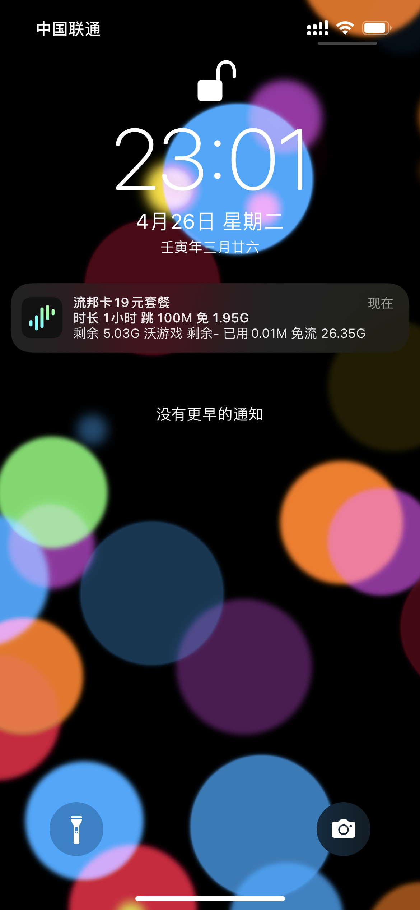</td>
    <td valign="top">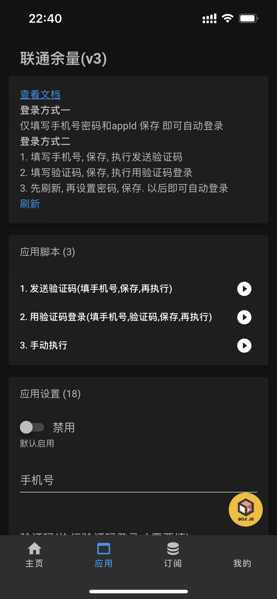</td>
    <td valign="top">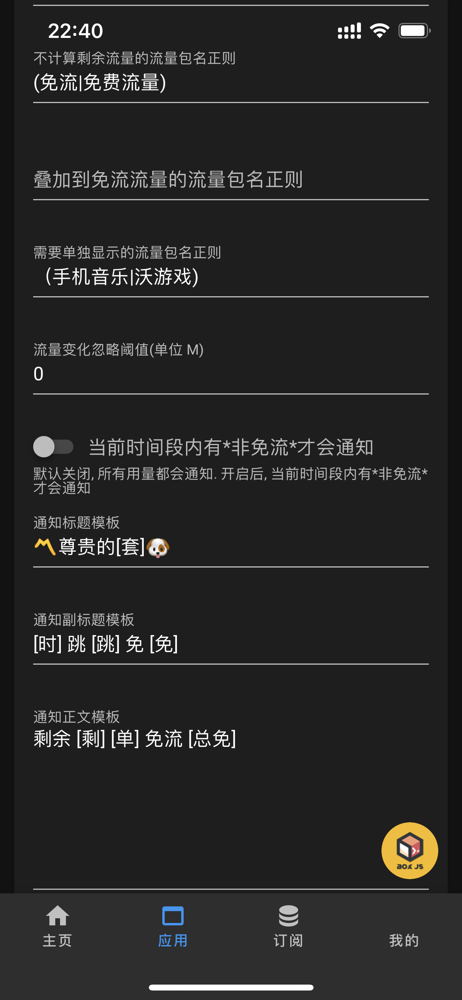</td>
    <td valign="top">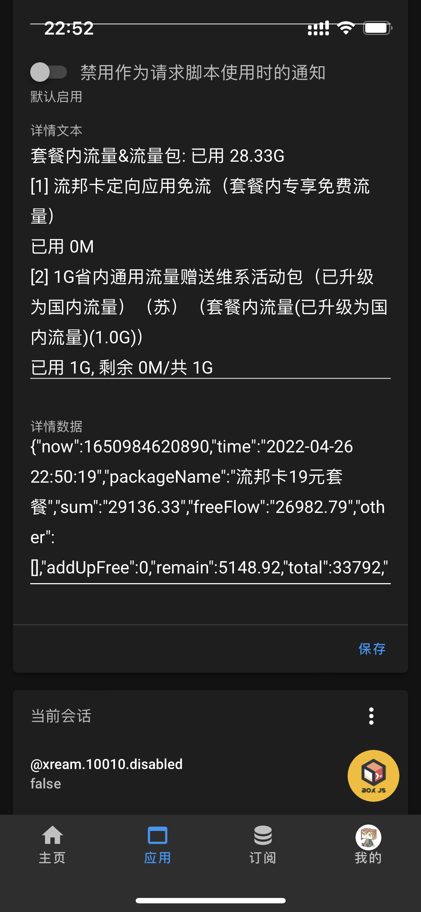</td>
  </tr>
 </table>

## 直接使用 Surge 模块

[https://raw.githubusercontent.com/xream/scripts/main/surge/modules/10010v3/10010.sgmodule](https://raw.githubusercontent.com/xream/scripts/main/surge/modules/10010v3/10010.sgmodule)

## Shadowrocket

> 吐槽 为什么就 Shadowrocket 用户要手把手教 🐶

兼容 直接使用 Surge 模块 [https://raw.githubusercontent.com/xream/scripts/main/surge/modules/10010v3/10010.sgmodule](https://raw.githubusercontent.com/xream/scripts/main/surge/modules/10010v3/10010.sgmodule)

<table>
  <tr>
    <td valign="top">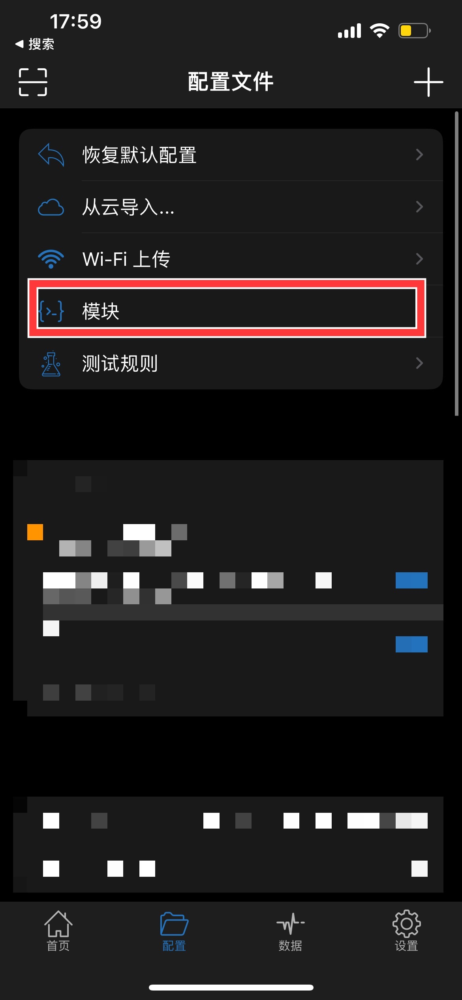</td>
    <td valign="top">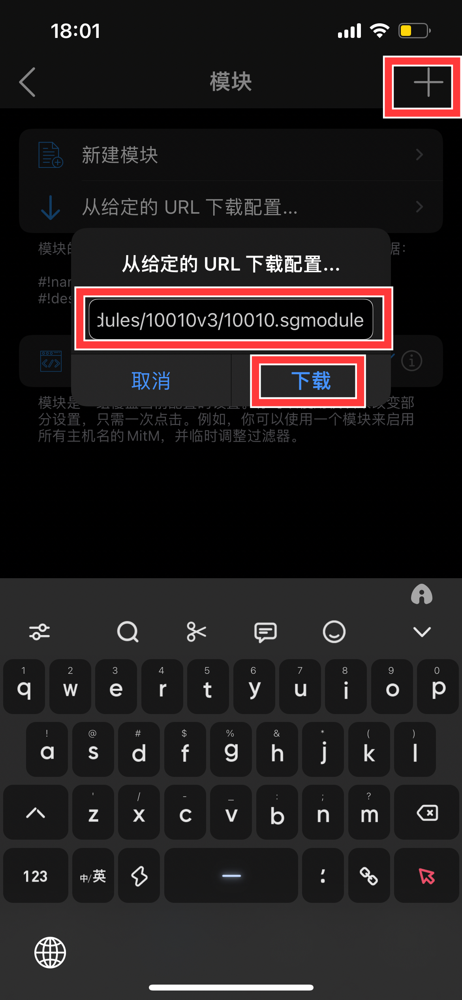</td>
    <td valign="top">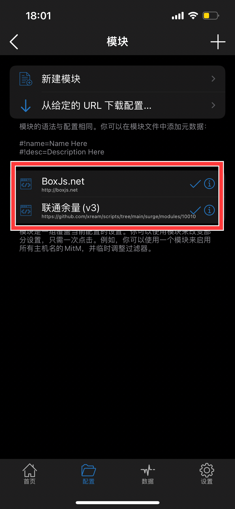</td>
  </tr>
 </table>

## Stash 使用覆写

[https://raw.githubusercontent.com/xream/scripts/main/surge/modules/10010v3/10010.rewrite.stash.stoverride](https://raw.githubusercontent.com/xream/scripts/main/surge/modules/10010v3/10010.rewrite.stash.stoverride)

Stash 暂不支持定时任务

可配合下方的 Scriptable 组件 实现伪定时刷新

iOS 小组件刷新时会触发实时查询

或 使用快捷指令定时触发. 参考下方截图, 运行一次尝试一下. 关闭`运行前询问`和`运行时通知`.

<table>
  <tr>
    <td valign="top">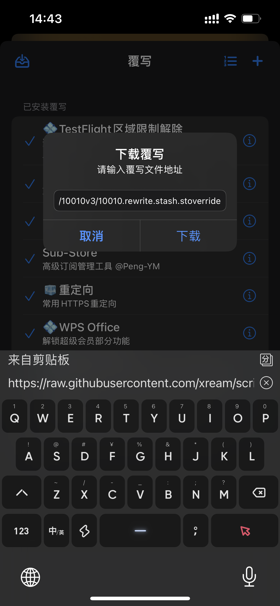</td>
    <td valign="top">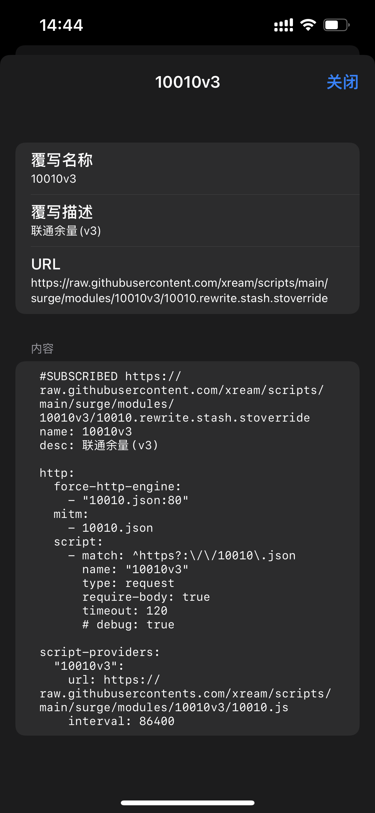</td>
    <td valign="top">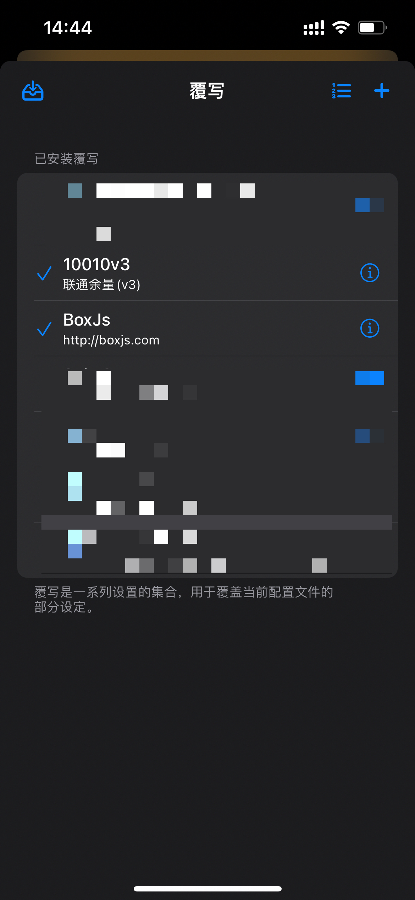</td>
    <td valign="top">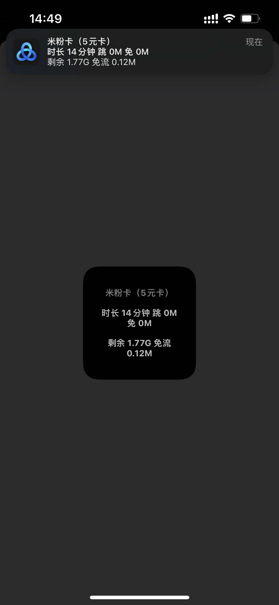</td>
    <td valign="top">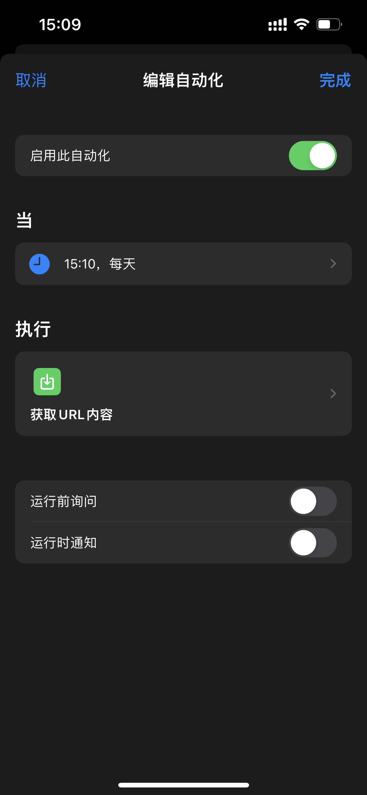</td>
    <td valign="top">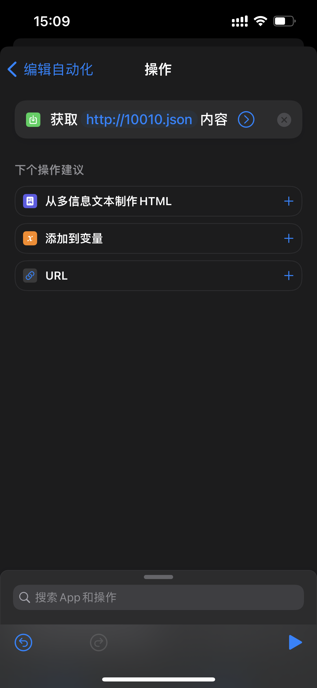</td>
  </tr>
 </table>

## 或者手动设置定时任务

### Surge

> 仅供参考 以该 app 最新配置为准 自行配置

```
[MITM]
hostname = 10010.json

[Script]
联通余量(v3)接口 = type=http-request,pattern=^https?:\/\/10010\.json,script-path=https://raw.githubusercontent.com/xream/scripts/main/surge/modules/10010v3/10010.js,requires-body=true,max-size=0,timeout=30

联通余量(v3) = type=cron,cronexp=*/5 * * * *,timeout=30,script-path=https://raw.githubusercontent.com/xream/scripts/main/surge/modules/10010v3/10010.js
```

### QuanX

> 仅供参考 以该 app 最新配置为准 自行配置

```
[task_local]
*/5 * * * * https://raw.githubusercontent.com/xream/scripts/main/surge/modules/10010v3/10010.js
```

### Loon

> 仅供参考 以该 app 最新配置为准 自行配置

```
[Script]
enable = true
cron "*/5 * * * *" script-path=https://raw.githubusercontent.com/xream/scripts/main/surge/modules/10010v3/10010.js
```

## BoxJs

> 不懂啥是 BoxJs 的 自己了解一下

[BoxJs 教程](https://www.google.com/search?q=BoxJs+%E6%95%99%E7%A8%8B)

> 步骤: 安装 BoxJs 模块, 安装 10010v3 模块, 在 BoxJs 里添加订阅. BoxJs 对应的应用配置里进行配置并保存.

使用 [BoxJs 测试版 https://docs.boxjs.app](https://docs.boxjs.app) 添加 订阅 [https://raw.githubusercontent.com/xream/scripts/main/boxjs/boxjs.json](https://raw.githubusercontent.com/xream/scripts/main/boxjs/boxjs.json)

BoxJs v0.10.0 后 支持一键添加订阅 可点击尝试 [http://boxjs.com/#/sub/add/https%3A%2F%2Fraw.githubusercontent.com%2Fxream%2Fscripts%2Fmain%2Fboxjs%2Fboxjs.json](http://boxjs.com/#/sub/add/https%3A%2F%2Fraw.githubusercontent.com%2Fxream%2Fscripts%2Fmain%2Fboxjs%2Fboxjs.json)

## 配置

### 登录方式一

仅填写手机号密码和 appId 保存 即可自动登录

### 登录方式二

> 请自行了解 http api 的概念, 执行脚本需要使用. 请在 Surge 中开启 HTTP API(可能需要关闭 HTTPS), 并在 BoxJs 中配置 HTTP API. 其他应用请参考对应的文档

<table>
  <tr>
    <td valign="top">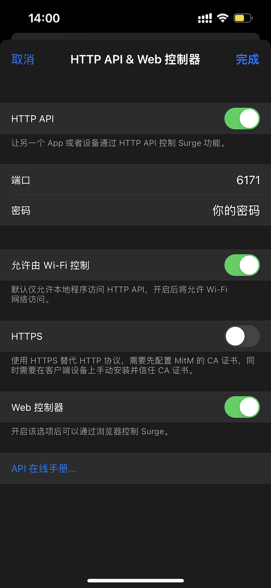</td>
    <td valign="top"></td>
  </tr>
 </table>

1. 填写手机号, 保存, 执行发送验证码
2. 填写验证码, 保存, 执行用验证码登录
3. 先刷新, 再设置密码, 保存. 以后即可自动登录

### 几个包名正则配置

1. 不计算剩余流量的流量包名正则(excludeRemainPkg)

在联通原始值不正确时 进行修正. 例 (定向流量|免流资费|免费流量) , 匹配的包不计算剩余

2. 叠加到免流流量的流量包名正则(freePkg)

在联通原始值不正确时 进行修正. 例 设置 (定向流量|免流资费|免费流量), 匹配的包叠加到总免流流量

3. 需要单独显示的流量包名正则(otherPkg)

例 设置 (加油包|福利|学习强国), 将显示 剩余 536.98M 加油包 46.12M 福利 490.86M 学习强国 1234.56M 免流 41.66G

### 修正联通的流量(剩余和免流)

联通返回了总的`已用流量`和`已免流量`, 但是`套餐内流量&流量包`里又会出现我们关注的免流包, 或者有不需要关注的免流包也有计入剩余流量.

举例:

1. 钉钉无限定向在 `套餐内流量&流量包`里, 是免流包. 所以我们可以设置 `叠加到免流流量的流量包名正则(freePkg)` 和 `不计算剩余流量的流量包名正则(excludeRemainPkg)` 为 `(钉钉定向免流资费|套餐内专享免费流量)`.

老有人看不懂...请复制下一行文字

`(钉钉定向免流资费|套餐内专享免费流量)`

粘贴到 BoxJs 设置里的 `叠加到免流流量的流量包名正则(freePkg)` 和 `不计算剩余流量的流量包名正则(excludeRemainPkg)` 两个输入框中. 还看不懂就看下面的截图.

2. 流邦卡在 `套餐内流量&流量包`里有一个 `30GB流邦卡专属免流包`. 此包有剩余流量数据. 但其实它是免流包, 我们不需要它计入总剩余流量. 所以我们可以设置 `不计算剩余流量的流量包名正则(excludeRemainPkg)` 为 `(免流包|套餐内专享免费流量)`

老有人看不懂...请复制下一行文字

`(免流包|套餐内专享免费流量)`

粘贴到 BoxJs 设置里的 `不计算剩余流量的流量包名正则(excludeRemainPkg)` 的输入框中. 还看不懂就看下面的截图.

3. 其他情况 请自行查看包(可在正常执行过一次后, 在 Box.js 界面最下方的详情里查看), 添加正则. 如果你不会正则, 可以直接按这个写 `(A|B|C)` 表示包含 A 或 B 或 C. 最好直接复制, 注意标点符号.

问的人 不看的人 太多了 贴图示例吧

> 不理解的话就直接复制上面举例的文字, 别手打中文括号还来问我.

> 不理解的话就直接复制上面举例的文字, 别手打中文括号还来问我.

> 不理解的话就直接复制上面举例的文字, 别手打中文括号还来问我.

<table>
  <tr>
    <td valign="top">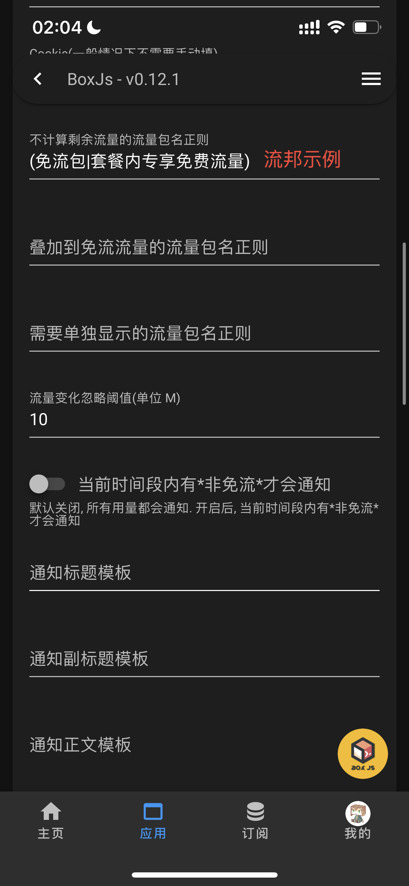</td>
    <td valign="top">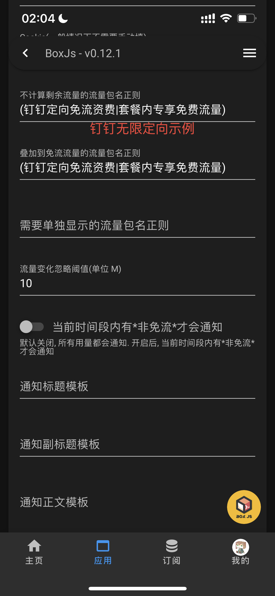</td>
  </tr>
 </table>

### 通知模板

通知标题模板

> 默认: [套], 例: 流邦卡 19 元套餐

通知副标题模板

> 默认: 时长 [时] 跳 [跳] 免 [免], 例: 时长 1 分钟 跳 10M 免 10M

通知正文模板

> 默认: 剩余 [剩] [单] 免流 [总免], 例: 剩余 5.03G 福利 1G 免流 26.35G

其他变量

> [现] 现在时间 [总] 总共流量

> [详] 所有流量包详情(比较长 需要你的推送服务支持长文本)

通知单独显示的包名模板(即 [单] 的内部模板) 这几个变量仅此处可用

> 默认: [包] 剩余[剩] 已用[用], 例: 福利包 剩余 1G 已用 1G

### 使用 Bark 通知而不是当前 app 的通知

~~主要是因为 Surge 的通知不好看~~

使用 Bark 通知 可实现更多通知效果: 推送铃声, 推送图标, 时效性通知, 复制推送内容等. 具体功能请参考 Bark 的设置说明.

<table>
  <tr>
    <td valign="top">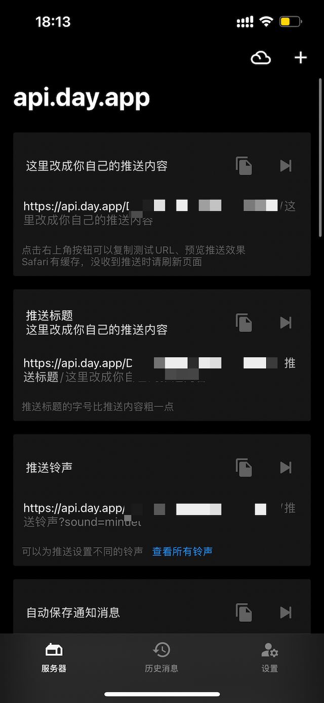</td>
    <td valign="top">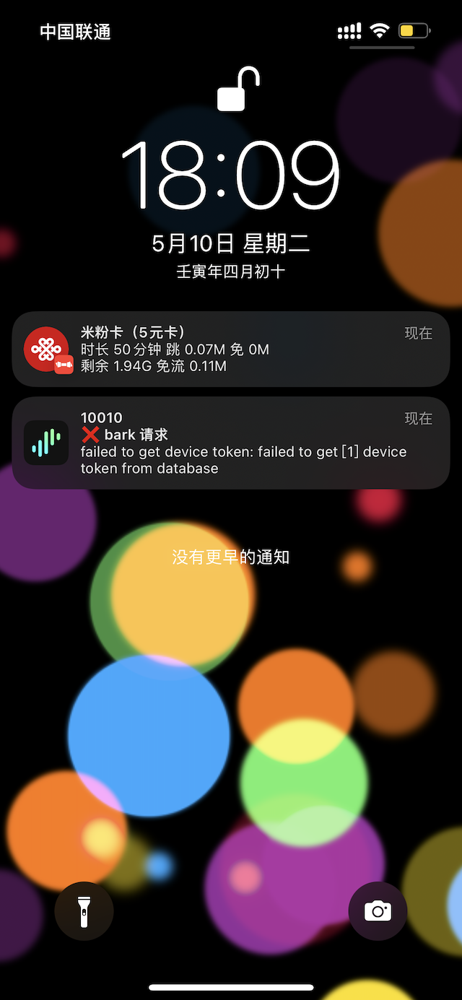</td>
    <td valign="top">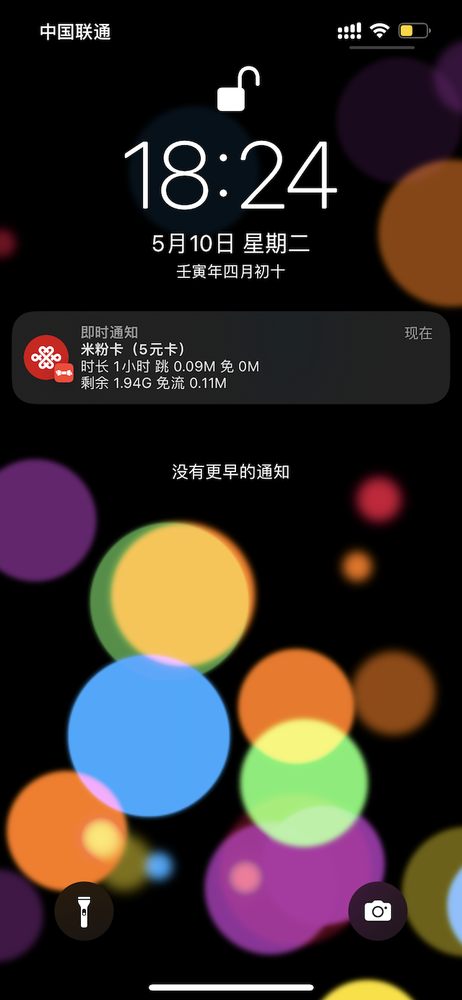</td>
  </tr>
 </table>

假设你 Bark 的链接为 `https://api.day.app/XXXXXXXXX/` 你的 key 为 `XXXXXXXXX`

可在 BoxJs 里设置 `Bark 推送` 为 `https://api.day.app/XXXXXXXXX/[推送标题]/[推送内容]?group=10010&autoCopy=1&isArchive=1&icon=https%3A%2F%2Fraw.githubusercontent.com%2Fanker1209%2Ficon%2Fmain%2Fzglt.png&sound=shake&level=timeSensitive`

`[推送标题]` `[推送内容]` 会被自动替换. 其他参数请参考 Bark 的设置说明.

### 推送通知优先级

1. 配置的 `Bark` 通知 和 sendNotify 文件通知(如青龙)
2. V2P 通知
3. app 自身通知

## V2P

在 `TASK(定时任务)` 中, 点击`添加单个任务`, 设置 `联通余量`, `cron定时`, `30 */5 * * * *`, `运行JS`, `https://raw.githubusercontent.com/xream/scripts/main/surge/modules/10010v3/10010.js`

#### 配置

在 `JSMANAGE(JS 文件管理)` 中的 `store/cookie 常量储存管理` 中手动设置, 参考以下内容(字段说明 以 [BoxJs 配置项](https://github.com/xream/scripts/blob/main/boxjs/boxjs.json)为准 ), 自行设置 KEY 和 VALUE 即可.

默认脚本为 `10010.js`, 使用 store 中的 `xream` 存储数据. 可手动执行一次脚本, store 中将自动创建该项.

```JSON
{"10010":{"appId":"","mobile":"","password":""}}
```

#### 多账号使用

默认脚本为 `10010.js`, 使用 store 中的 `xream` 存储数据.

命名为 `_ABC_10010.js` 时, 使用 store 中的 `ABC` 存储数据.

## 青龙

拉取单独文件 `ql raw https://raw.githubusercontent.com/xream/scripts/main/surge/modules/10010v3/10010.js`

设置定时任务

> 因为多个脚本同时读写同一个文件的问题 所以这里对 读写的文件路径 `box.dat` 做了破坏性的改动

可以先手动执行一次, 脚本管理里会出现 `10010-box.dat` 文件.

配置文件 `10010-box.dat`

参考以下内容(字段说明 以 [BoxJs 配置项](https://github.com/xream/scripts/blob/main/boxjs/boxjs.json)为准 ), 自行设置 KEY 和 VALUE 即可

```JSON
{"xream":"{\"10010\":{\"appId\":\"\", \"mobile\":\"\", \"password\":\"\"}}"}
```

如果你搞不清这个被转义过的语法 我建议你编辑 `10010.js` 文件

比如 你查看了 [BoxJs 配置项](https://github.com/xream/scripts/blob/main/boxjs/boxjs.json) 里配置

你想设置 `appId`, `手机号`, `服务密码`, `通知正文模板` 和 `流量变化忽略阈值`

以 `通知正文模板` 为例

BoxJs 里 `通知正文模板` 是 `body`

```
{
  "id": "@xream.10010.body",
  "name": "通知正文模板",
  "val": "",
  "type": "textarea",
  "desc": "默认: 剩余 [剩] [单] 免流 [总免], 例: 剩余 5.03G 福利 1G 免流 26.35G"
}
```

代码中对应的是 `const KEY_BODY = `@${namespace}.10010.body``

所以应该使用这样的逻辑 `$.setdata('剩余 [剩] [单] 免流 [总免]\n[详]', KEY_BODY);`

在 `$.setdata(new Date().toLocaleString('zh'), KEY_INITED)` 这一行下面插入

```
$.setdata('appId', KEY_APPID);
$.setdata('手机号', KEY_MOBILE);
$.setdata('服务密码', KEY_PASSWORD);
$.setdata('服务密码', KEY_PASSWORD);
$.setdata('剩余 [剩] [单] 免流 [总免]\n[详]', KEY_BODY);
$.setdata(10, KEY_IGNORE_FLOW);

// 其他配置字段以此类推
```

#### 通知

`sendNotify.js` 版本不一, 可能标题和正文之间有多次换行. 如果要实现一个通知横幅看全标题/副标题/正文三行, 需要自己修改 `sendNotify.js`.

例如: 修改 青龙 `sendNotify.js` 里的 `function ddBotNotify` 里的拼接字符串逻辑, 把 `${text}\n\n${desp}` 改成 `${text}\n${desp}`

脚本会尝试加载同目录下的 `10010_sendNotify.js` 文件, 再尝试加载 `sendNotify.js`. 所以你可以创建一个 `10010_sendNotify.js` 文件实现通知的自定义逻辑.

#### 多账号使用

默认脚本使用 `10010-box.dat` 中的 `xream` 存储数据.

命名为 `_ABC_10010.js` 时, 使用 `ABC-10010-box.dat` 中的 `ABC` 存储数据.

若要实现多账号使用不同的通知方式, 可参考如下操作:

例如, 默认使用的是钉钉, 现在希望账号 miku 使用 Bark.

可以在 `_ABC_10010.js` 最上方添加如下代码:

```JavaScript
process.env.DD_BOT_TOKEN=undefined
process.env.DD_BOT_SECRET=undefined

process.env.BARK_PUSH="https://api.day.app/123456789"
```

意思是清除默认的钉钉的环境变量, 并设置 Bark 的环境变量

脚本会尝试加载同目录下的 `_ABC_10010_sendNotify.js` 文件, 再尝试加载 `10010_sendNotify.js`, 最后尝试加载 `sendNotify.js`. 所以你可以创建一个 `_ABC_10010_sendNotify.js` 文件实现通知的自定义逻辑.

## Surge Panel

<table>
  <tr>
    <td valign="top">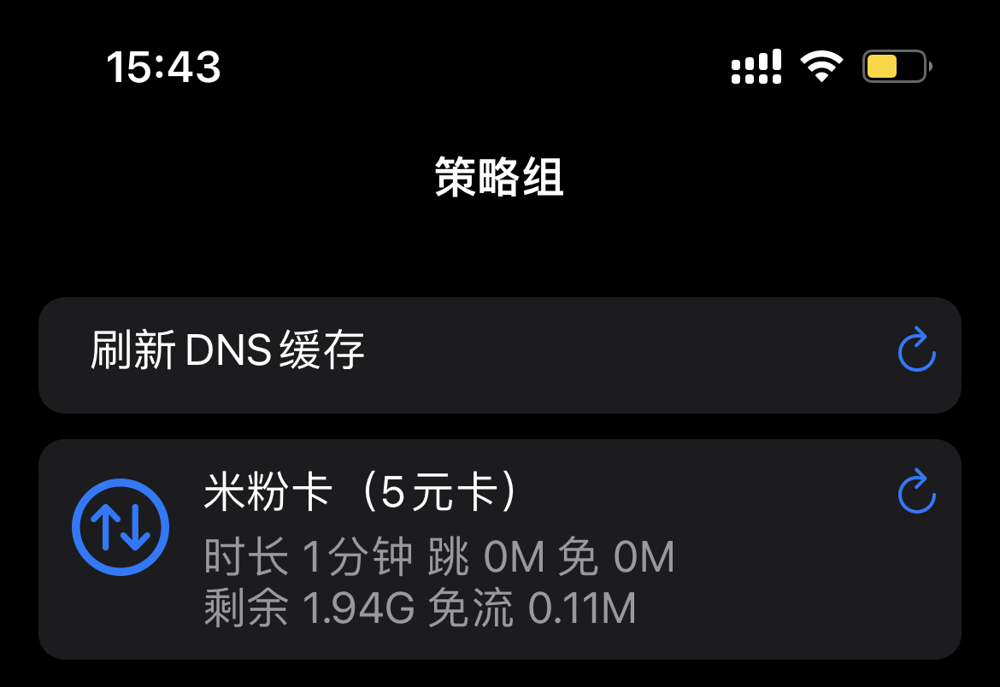</td>
  </tr>
</table>

请求 `http(s)://10010.json` 接口, 直接返回余量信息.

需要脚本配合 Surge 模块默认已开启此接口. 其他客户端的配置请自行参考对应的配置方式, 可参考 Surge 的手动配置方式:

> 仅供参考 以该 app 最新配置为准 自行配置

请求时的通知可在 Box.js 设置中关闭(禁用作为 panel 脚本使用时的通知).

```
[MITM]
hostname = 10010.json

[Script]
联通余量(v3) = type=cron,cronexp=*/5 * * * *,timeout=30,script-path=https://raw.githubusercontent.com/xream/scripts/main/surge/modules/10010v3/10010.js

联通余量(v3)接口 = type=http-request,pattern=^https?:\/\/10010\.json,script-path=https://raw.githubusercontent.com/xream/scripts/main/surge/modules/10010v3/10010.js,requires-body=true,max-size=0,timeout=30

# Panel
panel-10010 = type=generic,timeout=60,script-path=https://raw.githubusercontent.com/xream/scripts/main/surge/modules/10010v3/10010.js,argument=icon=arrow.up.arrow.down.circle&color=#5d84f8

[Panel]
panel-10010 = script-name=panel-10010,update-interval=1
```

## Scriptable

原理: 优先从 `http(s)://10010.json` 获取实时数据, 如果失败则从 `http://boxjs.net/query/boxdata` 获取缓存数据.

boxjs 的缓存数据是由定时任务更新的

### 如何配置获取实时数据

请求 `http(s)://10010.json` 接口, 直接返回余量信息.

需要脚本配合 Surge 模块默认已开启此接口. 其他客户端的配置请自行参考对应的配置方式, 可参考 Surge 的手动配置方式:

> 仅供参考 以该 app 最新配置为准 自行配置

```
[MITM]
hostname = 10010.json

[Script]
联通余量(v3) = type=cron,cronexp=*/5 * * * *,timeout=30,script-path=https://raw.githubusercontent.com/xream/scripts/main/surge/modules/10010v3/10010.js

联通余量(v3)接口 = type=http-request,pattern=^https?:\/\/10010\.json,script-path=https://raw.githubusercontent.com/xream/scripts/main/surge/modules/10010v3/10010.js,requires-body=true,max-size=0,timeout=30
```

请求时的通知可在 Box.js 设置中关闭(禁用作为请求脚本使用时的通知).

仅提供最简实现方式的展示, 可自行修改源码

## 脚本

依赖: [「小件件」开发环境.js](https://raw.githubusercontent.com/xream/scripts/main/scriptable/「小件件」开发环境.js)

[10010.js](https://raw.githubusercontent.com/xream/scripts/main/scriptable/10010/10010.js)

<table>
  <tr>
    <td valign="top">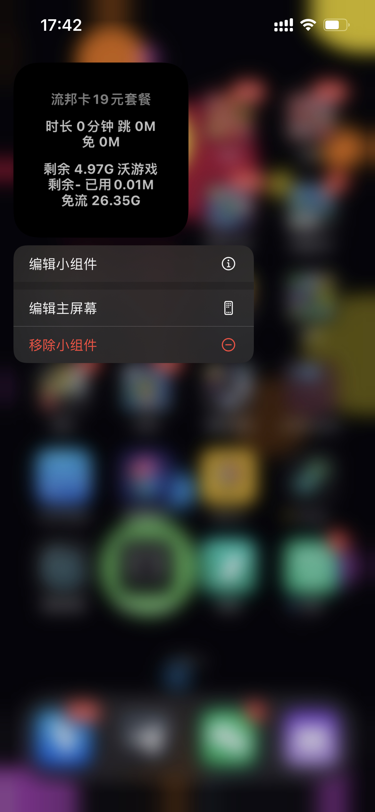</td>
    <td valign="top">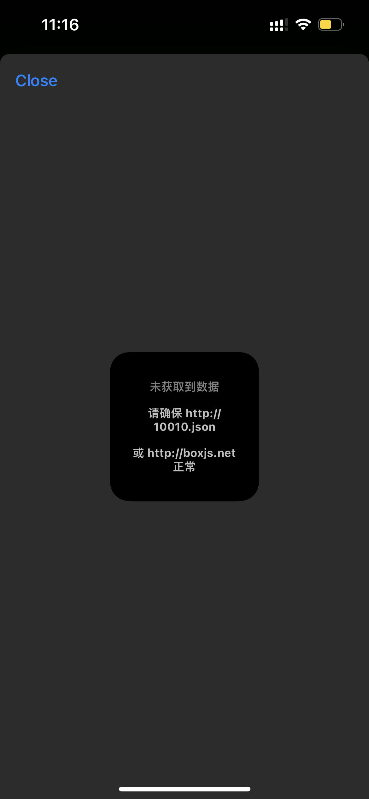</td>
  </tr>
 </table>
```
