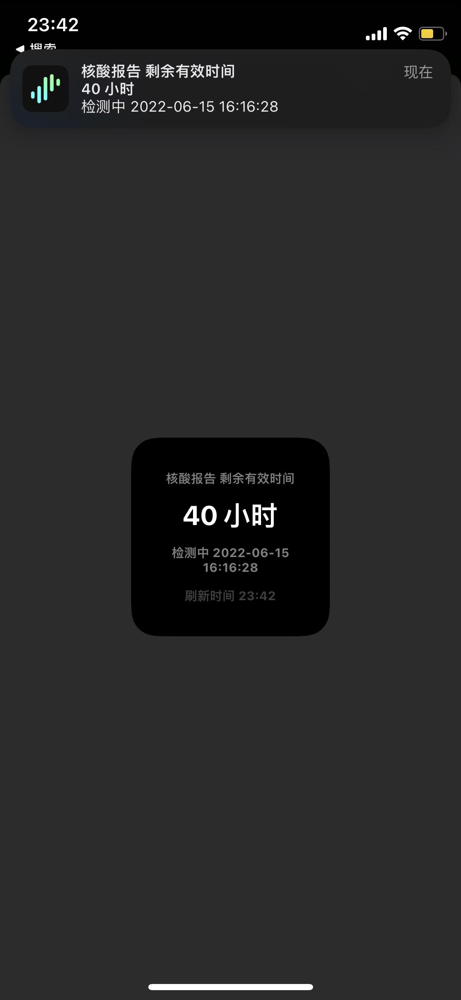
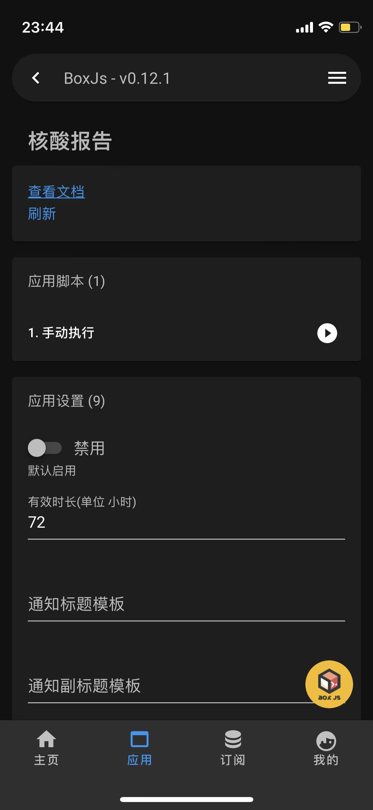
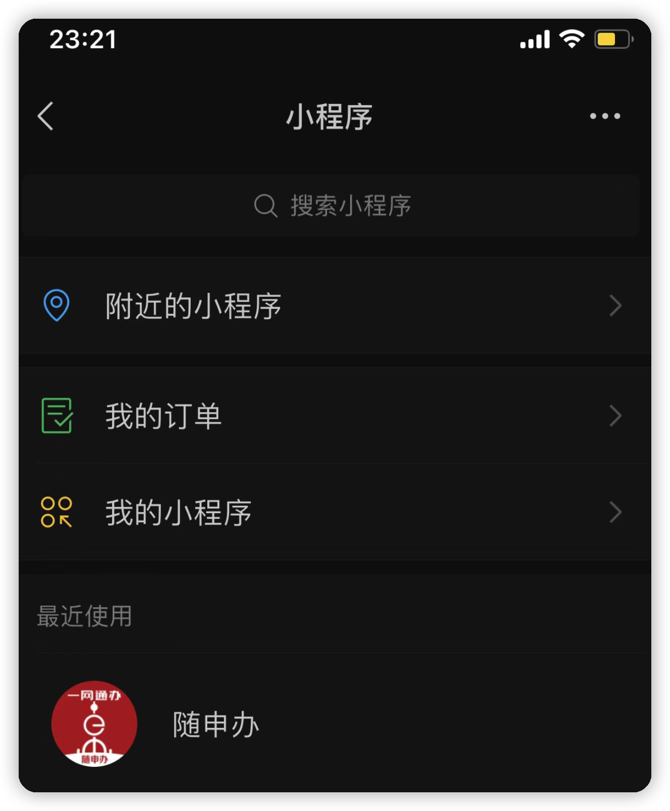
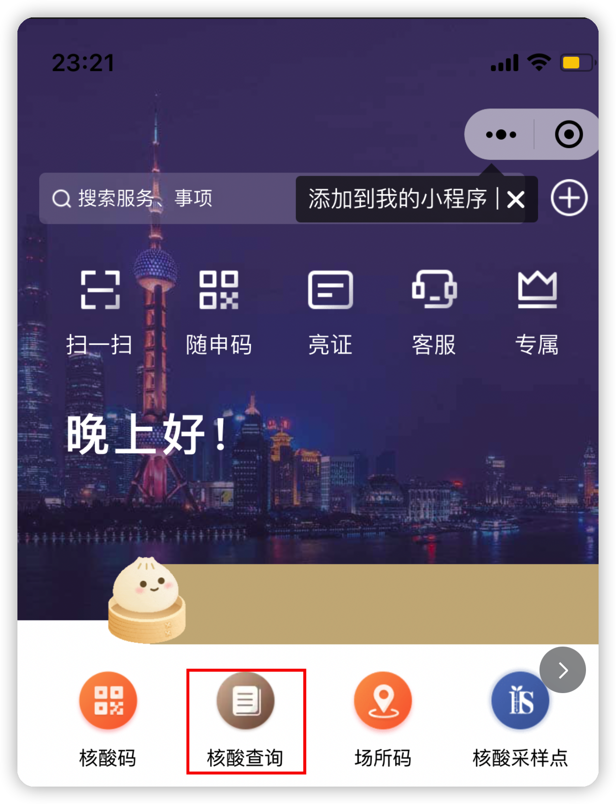
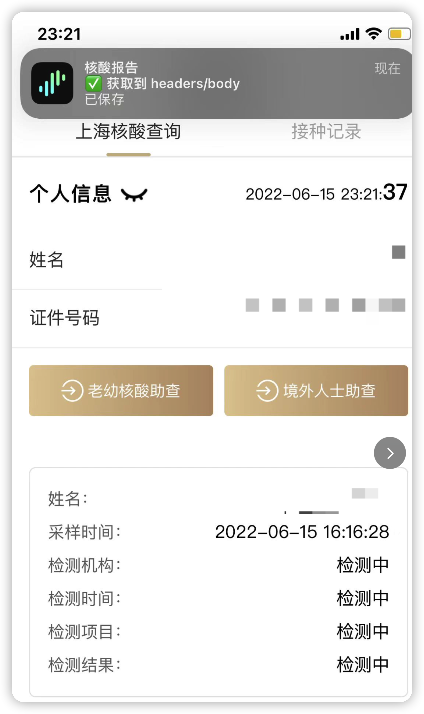
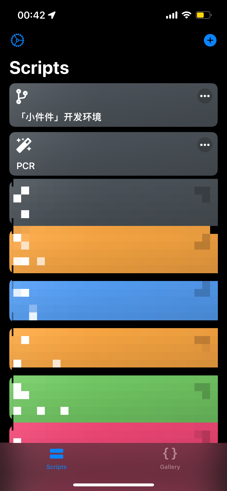
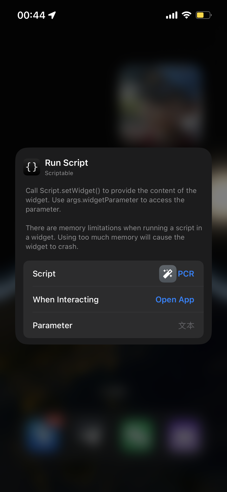

# 核酸报告(仅支持上海)

> 欢迎关注频道 [https://t.me/zhetengsha](https://t.me/zhetengsha) 加入群组 [https://t.me/zhetengsha_group](https://t.me/zhetengsha_group)

使用了 [chavyleung 大佬的 Env.js](https://github.com/chavyleung/scripts/blob/master/Env.js). 兼容 QuanX, Surge, Loon, Shadowrocket, Stash 等客户端

特点:

🔧 支持自定义通知模板

🔔 支持 Bark/PushDeer 多平台都可以收到通知了

🚀 支持 Scriptable 小组件

<table>
  <tr>
    <td valign="top"></td>
    <td valign="top"></td>
  </tr>
</table>

## 直接使用 Surge 模块

> 默认每天早上 8 点推送 若要自定义 参考下面的配置 自己修改 cron 的部分

[https://raw.githubusercontent.com/xream/scripts/main/surge/modules/pcr/pcr.sgmodule](https://raw.githubusercontent.com/xream/scripts/main/surge/modules/pcr/pcr.sgmodule)

`Shadowrocket` 也支持 使用类似 `Surge`

## 其他客户端请自行参考 Surge 的配置, 使用对应客户端语法自行配置

```
[MITM]
hostname = smartgate.ywtbsupappw.sh.gov.cn, pcr.json

[Script]

核酸报告-抓包 = type=http-request,pattern=https?:\/\/smartgate\.ywtbsupappw\.sh\.gov\.cn\/ebus\/swift\/mw\/v1,requires-body=1,max-size=0,timeout=30,script-path=https://raw.githubusercontent.com/xream/scripts/main/surge/modules/pcr/pcr.js

核酸报告-接口 = type=http-request,pattern=^https?:\/\/pcr\.json,requires-body=1,max-size=0,timeout=30,script-path=https://raw.githubusercontent.com/xream/scripts/main/surge/modules/pcr/pcr.js

核酸报告-定时任务 = type=cron,cronexp=0 8 * * *,timeout=30,script-path=https://raw.githubusercontent.com/xream/scripts/main/surge/modules/pcr/pcr.js

```

## 抓包

<table>
  <tr>
    <td valign="top"></td>
    <td valign="top"></td>
    <td valign="top"></td>
  </tr>
</table>

## BoxJs

使用 [BoxJs 测试版](https://chavyleung.gitbook.io/boxjs) 添加 订阅 [https://raw.githubusercontent.com/xream/scripts/main/boxjs/boxjs.json](https://raw.githubusercontent.com/xream/scripts/main/boxjs/boxjs.json)

BoxJs v0.10.0 后 支持一键添加订阅 可点击尝试 [http://boxjs.com/#/sub/add/https%3A%2F%2Fraw.githubusercontent.com%2Fxream%2Fscripts%2Fmain%2Fboxjs%2Fboxjs.json](http://boxjs.com/#/sub/add/https%3A%2F%2Fraw.githubusercontent.com%2Fxream%2Fscripts%2Fmain%2Fboxjs%2Fboxjs.json)

## 配置

基本上打开 BoxJs 都能看明白

### 通知模板

通知标题模板

> 默认: 核酸报告 剩余有效时间

通知副标题模板

> 默认: [剩余小时数] 小时, 例: 48 小时

通知正文模板

> 默认: 检测中 [检测中的采样时间], 例: 检测中 2022-06-13 22:32:02

其他变量

> 已出检测结果的 [采样时间], [检测时间], [姓名], [检测项目], [检测机构], [检测结果]

> [剩余天数部分], [剩余小时部分]

> [有效时长]

### 使用 PushDeer/PushPlus 等服务

1. 假设你 PushDeer 的链接为 `https://api2.pushdeer.com/message/push?pushkey=XXXXXXXXXXX` 你的 key 为 `XXXXXXXXX`

可在 BoxJs 里设置 `PushDeer/PushPlus 等` 为 `https://api2.pushdeer.com/message/push?pushkey=XXXXXXXXXXX&text=[推送全文]`

2. 假设你 PushPlus 的链接为 `http://www.pushplus.plus/send?token=XXXXXXXXX&content=[推送全文]&channel=wechat` 你的 key 为 `XXXXXXXXX`

其他参数可查看官方文档 [PushPlus 发送消息接口](http://www.pushplus.plus/doc/guide/api.html#%E4%B8%80%E3%80%81%E5%8F%91%E9%80%81%E6%B6%88%E6%81%AF%E6%8E%A5%E5%8F%A3)

例如 上述链接中的 `wechat` 改为 `mail` 即可实现邮件转发.

可在 BoxJs 里设置 `PushDeer/PushPlus 等` 为 `http://www.pushplus.plus/send?token=XXXXXXXXX&content=[推送全文]&channel=wechat`

`[推送全文]` 会被自动替换

> 聪明的你一定能看懂吧

其实不管什么服务 只要是 get 请求就可以支持. 只要在对应的参数留好 `[推送全文]`

但是可能不同的服务返回值不同 如果发现有实际成功但是提示未知错误的 可以发日志给我

### 使用 Bark 等服务

使用 Bark 通知 可实现更多通知效果: 推送铃声, 推送图标, 时效性通知, 复制推送内容等. 具体功能请参考 Bark 的设置说明.

假设你 Bark 的链接为 `https://api.day.app/XXXXXXXXX/` 你的 key 为 `XXXXXXXXX`

可在 BoxJs 里设置 `Bark/自建服务端等` 为 `https://api.day.app/XXXXXXXXX/[推送标题]/[推送内容]?group=sms&autoCopy=1&isArchive=1&icon=https%3A%2F%2Fraw.githubusercontent.com%2Fxream%2Fscripts%2Fmain%2Fsurge%2Fmodules%2Fpcr%2Fasset%2Ficon.png&copy=[复制内容]&sound=shake&level=timeSensitive`

`[推送标题]` `[推送内容]` `[复制内容]` 会被自动替换. 其他参数请参考 Bark 的设置说明.

> 聪明的你一定能看懂吧

其实不管什么服务 只要是 get 请求就可以支持. 只要在对应的参数留好 `[推送标题]` `[推送内容]` `[复制内容]`

但是可能不同的服务返回值不同 如果发现有实际成功但是提示未知错误的 可以发日志给我

## Scriptable

> 小组件刷新机制不可控 请自行 Google

原理: 优先从 `http(s)://pcr.json` 获取实时数据, 如果失败则从 `http://boxjs.net/query/boxdata` 获取缓存数据.

### 缓存数据的有效性/实时性

BoxJs 的缓存数据是由定时任务更新的

### 如何配置获取实时数据

请求 `http(s)://pcr.json` 接口, 直接返回信息.

需要脚本配合 Surge 模块默认已开启此接口. 其他客户端的配置请自行参考对应的配置方式, 可参考 Surge 的手动配置方式:

> 仅供参考 以该 app 最新配置为准 自行配置

```
[MITM]
hostname = smartgate.ywtbsupappw.sh.gov.cn, pcr.json

[Script]

核酸报告-抓包 = type=http-request,pattern=https?:\/\/smartgate\.ywtbsupappw\.sh\.gov\.cn\/ebus\/swift\/mw\/v1,requires-body=1,max-size=0,timeout=30,script-path=https://raw.githubusercontent.com/xream/scripts/main/surge/modules/pcr/pcr.js

核酸报告-接口 = type=http-request,pattern=^https?:\/\/pcr\.json,requires-body=1,max-size=0,timeout=30,script-path=https://raw.githubusercontent.com/xream/scripts/main/surge/modules/pcr/pcr.js

核酸报告-定时任务 = type=cron,cronexp=0 8 * * *,timeout=30,script-path=https://raw.githubusercontent.com/xream/scripts/main/surge/modules/pcr/pcr.js

```

请求时的通知可在 BoxJs 设置中关闭(禁用作为请求脚本使用时的通知).

仅提供最简实现方式的展示, 可自行修改源码

## 脚本

依赖: [「小件件」开发环境.js](https://raw.githubusercontent.com/xream/scripts/main/scriptable/「小件件」开发环境.js)

[PCR.js](https://raw.githubusercontent.com/xream/scripts/main/scriptable/pcr/PCR.js)

<table>
  <tr>
    <td valign="top"></td>
    <td valign="top"></td>
    <td valign="top"></td>
  </tr>
 </table>
```
