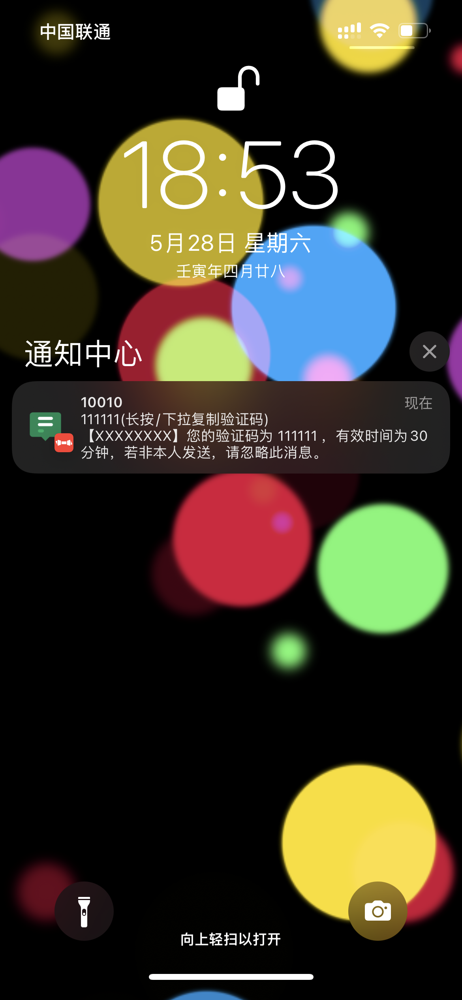
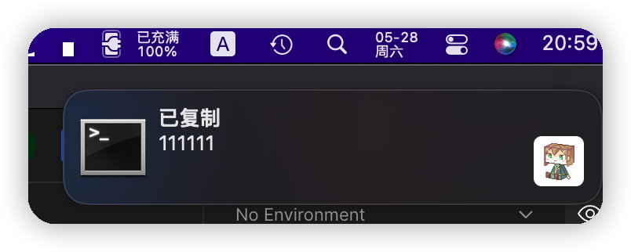
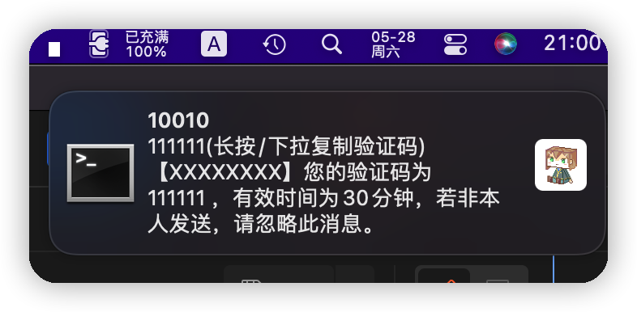

# 短信转发

使用了 [chavyleung 大佬的 Env.js](https://github.com/chavyleung/scripts/blob/master/Env.js). 兼容 QuanX, Surge, Loon, Shadowrocket, Stash 等客户端

特点:

🎉 免越狱支持 iOS 短信转发

🔒️ 可禁止提交数据给腾讯/360 等接口 保证隐私

🔒️ 将提交给腾讯/360 等接口的内容中的数字替换为随机数字 防止泄漏

🔧 支持自定义规则控制是否转发

🔧 支持自定义通知模板

🔢 自动提取验证码

- 使用 Bark 则可长按/下拉复制验证码

- 使用自建接口配合桌面端工具, 则可实现桌面端自动复制验证码

<table>
  <tr>
    <td valign="top"></td>
    <td valign="top"></td>
    <td valign="top"></td>
  </tr>
</table>

## 安装/设置 `腾讯手机管家` 和 `360手机卫士`

1. 安装后按 app 提示开启短信骚扰拦截.

2. 如下图开启 `精准查询`(腾讯手机管家) / `智能云端引擎精准过滤`(360 手机卫士)

3. 在系统设置里, 将`未知与过滤信息` 设为对应的 app

<table>
  <tr>
    <td valign="top"></td>
    <td valign="top"></td>
    <td valign="top"></td>
  </tr>
 </table>

## 直接使用 Surge 模块

[https://raw.githubusercontent.com/xream/scripts/main/surge/modules/sms-forward/sms-forward.sgmodule](https://raw.githubusercontent.com/xream/scripts/main/surge/modules/sms-forward/sms-forward.sgmodule)

`Shadowrocket` 也支持 使用类似 `Surge`

## Stash 使用覆写

[https://raw.githubusercontent.com/xream/scripts/main/surge/modules/sms-forward/sms-forward.rewrite.stash.stoverride](https://raw.githubusercontent.com/xream/scripts/main/surge/modules/sms-forward/sms-forward.rewrite.stash.stoverride)

## 其他客户端的配置请自行参考对应的配置方式

## BoxJs

使用 [BoxJs 测试版](https://chavyleung.gitbook.io/boxjs) 添加 订阅 [https://raw.githubusercontent.com/xream/scripts/main/boxjs/boxjs.json](https://raw.githubusercontent.com/xream/scripts/main/boxjs/boxjs.json)

BoxJs v0.10.0 后 支持一键添加订阅 可点击尝试 [http://boxjs.com/#/sub/add/https%3A%2F%2Fraw.githubusercontent.com%2Fxream%2Fscripts%2Fmain%2Fboxjs%2Fboxjs.json](http://boxjs.com/#/sub/add/https%3A%2F%2Fraw.githubusercontent.com%2Fxream%2Fscripts%2Fmain%2Fboxjs%2Fboxjs.json)

## 配置

基本上打开 BoxJs 都能看明白

### 通知模板

通知标题模板

> 默认: [号码], 例: 10010

通知副标题模板

> 默认: [码][复制提示], 例: 123456(长按/下拉复制验证码)

通知正文模板

> 默认: [内容], 例: 您的验证码为 123456

### 使用 Bark 通知转发

使用 Bark 通知 可实现更多通知效果: 推送铃声, 推送图标, 时效性通知, 复制推送内容等. 具体功能请参考 Bark 的设置说明.

假设你 Bark 的链接为 `https://api.day.app/XXXXXXXXX/` 你的 key 为 `XXXXXXXXX`

可在 BoxJs 里设置 `Bark 推送` 为 `https://api.day.app/XXXXXXXXX/[推送标题]/[推送内容]?group=sms&autoCopy=1&isArchive=1&icon=https%3A%2F%2Fraw.githubusercontent.com%2Fxream%2Fscripts%2Fmain%2Fsurge%2Fmodules%2Fsms-forward%2Fasset%2F1.png&copy=[复制内容]`

`[推送标题]` `[推送内容]` `[复制内容]` 会被自动替换. 其他参数请参考 Bark 的设置说明.

### 使用自建服务端和客户端进行通知转发

#### 服务端

`https://github.com/xream/scripts/tree/main/surge/modules/sms-forward/server`

```
pnpm i
mv .env-sample .env
```

编辑 `.env` 设置 token 等参数

```
pnpm start
```

请求参数:

`autoCopy` 是否自动复制

`copy` 复制的内容

其他参数 参考 `https://www.npmjs.com/package/node-notifier` 文档

例如 `contentImage` 附加图片的本地路径(指的是下面的客户端运行的环境)

`sound` 通知声音 等等

可在 BoxJs 里设置 `Bark 推送` 为 `http://服务器IP:服务器端口/你设置的token/[推送标题]/[推送内容]?autoCopy=1&copy=[复制内容]&sound=true&contentImage=%2FUsers%2Fxream%2FDropbox%2Fpics%2Favatar%2Favatar_large.png`

自建域名转发等等不再赘述

#### 客户端

<table>
  <tr>
    <td valign="top"></td>
    <td valign="top"></td>
    <td valign="top"></td>
    <td valign="top"></td>
  </tr>
 </table>

`https://github.com/xream/scripts/tree/main/surge/modules/sms-forward/server`

```
pnpm i
mv .env-sample .env
```

编辑 `.env` 设置 `服务器`, `自动复制内容最大长度` 等参数

```
pnpm start
```
