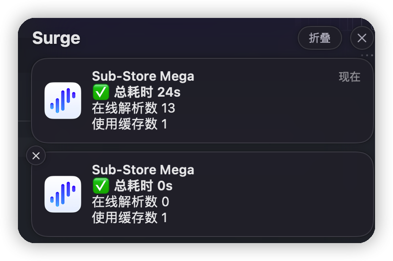
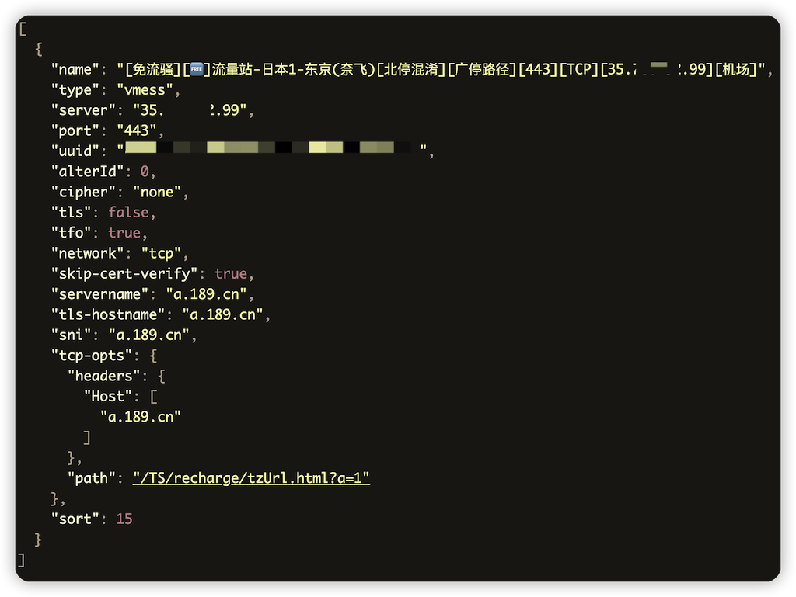
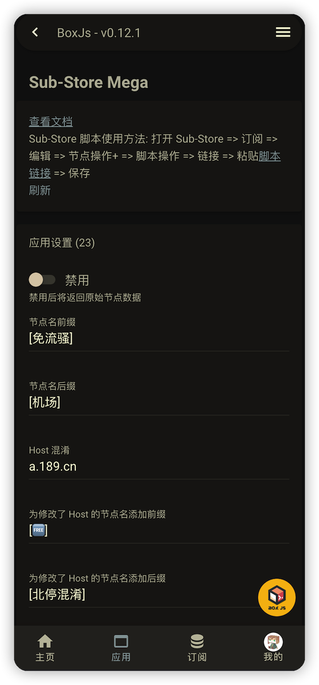
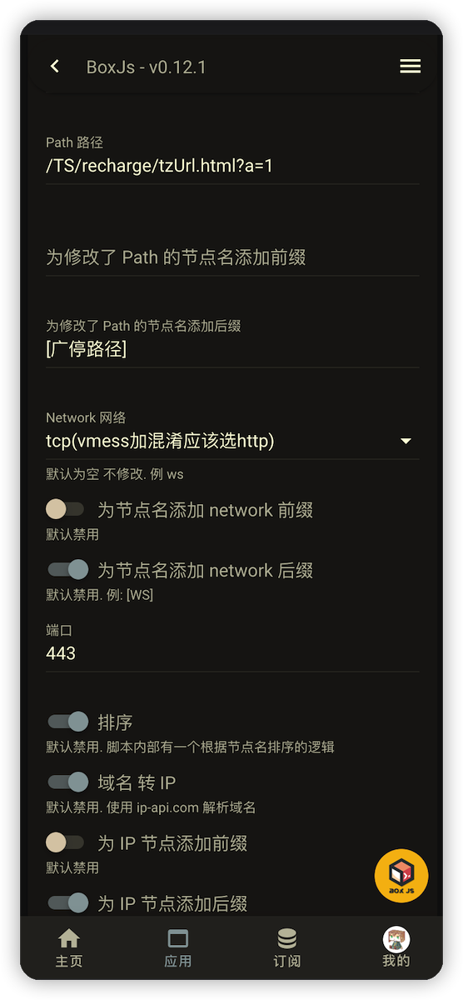
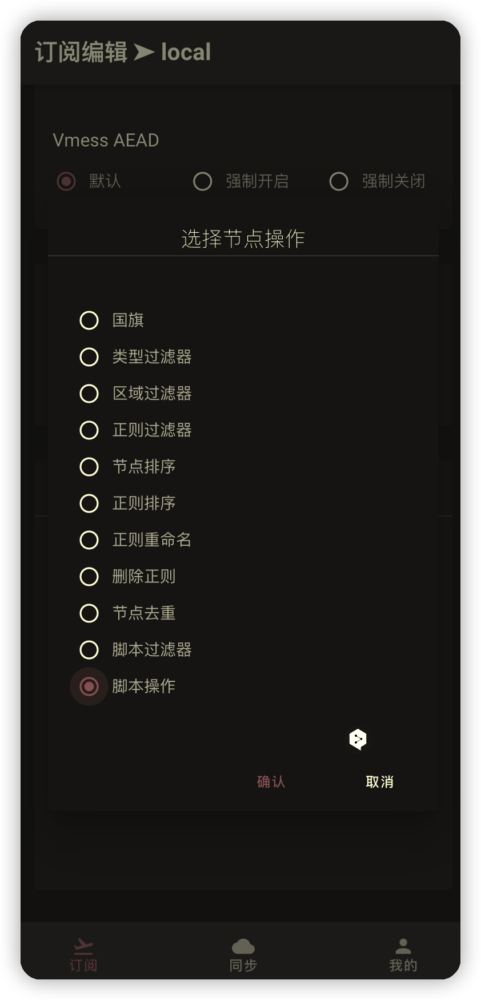
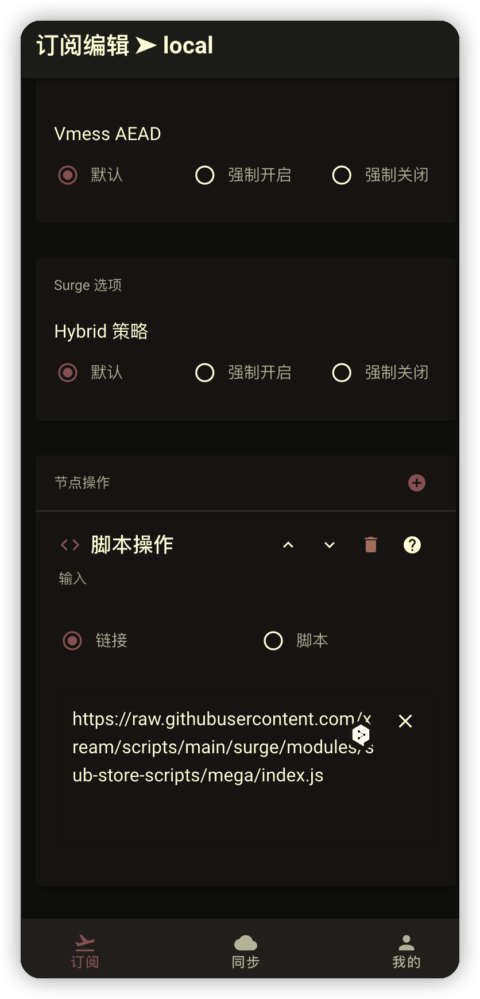

# Sub-Store Mega

> 欢迎关注频道 [https://t.me/zhetengsha](https://t.me/zhetengsha) 加入群组 [https://t.me/zhetengsha_group](https://t.me/zhetengsha_group)

使用了 [chavyleung 大佬的 Env.js](https://github.com/chavyleung/scripts/blob/master/Env.js). 兼容 QuanX, Surge, Loon, Shadowrocket, Stash 等客户端

特点:

- 设置 `Host 混淆`, `端口`

- 节点服务器域名 转 IP. 对接多个服务. 支持缓存

- [🐞⚠️ bug 警告] 设置 `Path 路径`, 修改 `Network 网络类型`

- 节点名/Host/Path/Network/IP 的前缀/后缀

<table>
  <tr>
    <td valign="top"></td>
    <td valign="top"></td>
  </tr>
  <tr>
    <td valign="top"></td>
    <td valign="top"></td>
  </tr>
</table>

## Sub-Store 脚本使用方法

打开 Sub-Store => 订阅 => 编辑 => 节点操作+ => 脚本操作 => 链接 => 粘贴 [https://raw.githubusercontent.com/xream/scripts/main/surge/modules/sub-store-scripts/mega/index.js](https://raw.githubusercontent.com/xream/scripts/main/surge/modules/sub-store-scripts/mega/index.js) => 保存

<table>
  <tr>
    <td valign="top"></td>
    <td valign="top"></td>
  </tr>
  
</table>

## BoxJs

使用 [BoxJs 测试版](https://chavyleung.gitbook.io/boxjs) 添加 订阅 [https://raw.githubusercontent.com/xream/scripts/main/boxjs/boxjs.json](https://raw.githubusercontent.com/xream/scripts/main/boxjs/boxjs.json)

BoxJs v0.10.0 后 支持一键添加订阅 可点击尝试 [http://boxjs.com/#/sub/add/https%3A%2F%2Fraw.githubusercontent.com%2Fxream%2Fscripts%2Fmain%2Fboxjs%2Fboxjs.json](http://boxjs.com/#/sub/add/https%3A%2F%2Fraw.githubusercontent.com%2Fxream%2Fscripts%2Fmain%2Fboxjs%2Fboxjs.json)

## 配置

基本上打开 BoxJs 都能看明白
