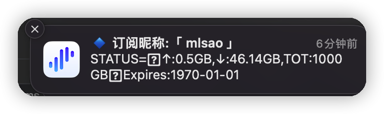

# Sub-Store 外置流量查询脚本

修改自 https://raw.githubusercontent.com/NobyDa/Script/master/Sub-store-parser/DataQuery.js

如果你的机场订阅是在响应头返回流量等信息的, 请使用原脚本.

本脚本会模拟 Shadowrocket 获取订阅信息中第一行非节点的文本并发送通知

该脚本基于 Sub-Store, 可解决 APP 使用 Sub-Store 链接后, 没有流量通知的问题. 使用前需确认您的机场订阅是否支持流量信息

Sub-Store 订阅管理器: https://github.com/Peng-YM/Sub-Store

使用方法: 打开 Sub-Store => 订阅 => 编辑 => 节点操作+ => 脚本操作 => 填入脚本链接或粘贴脚本 => 保存

您的 APP 更新 Sub-Store 订阅链接时, 将自动发送流量通知.

脚本链接: https://raw.githubusercontent.com/xream/scripts/main/surge/modules/sub-store-scripts/sub-info/index.js

> 没时间调研 base64 decode 暂不支持 emoji 等特殊字符

<table>
  <tr>
    <td valign="top"></td>
    <td valign="top"></td>
  </tr>
 </table>

## 鸣谢

### 原脚本

https://raw.githubusercontent.com/NobyDa/Script/master/Sub-store-parser/DataQuery.js

### 资源解析器

https://github.com/KOP-XIAO/QuantumultX/blob/master/Scripts/resource-parser.js

### Sub-Store

https://github.com/Peng-YM/Sub-Store

### Cool Scripts

https://t.me/cool_scripts
